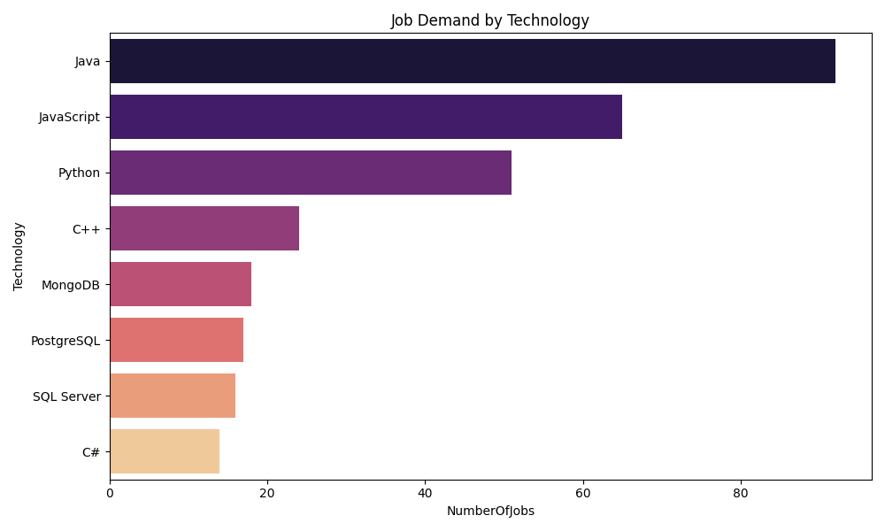

# IBM Data Analyst: Automated Pipeline 📊

This repository features a professional **ETL (Extract, Transform, Load)** pipeline designed to automate the collection, processing, and visualization of programming language salaries and global job demand.

## 🚀 Key Features
* **Automated Extraction:** Scrapes live salary data from IBM-hosted HTML datasets using `BeautifulSoup`.
* **API Integration:** Fetches real-time job posting counts for major technologies via JSON API endpoints.
* **Data Sanitization:** Uses `Pandas` to clean currency strings, handle missing values, and aggregate records.
* **Visual Analytics:** Generates production-ready demand charts using `Seaborn` and `Matplotlib`.
* **Production Logging:** Includes a persistent `pipeline.log` to monitor script health and track execution history.

## 📈 Market Insights
Below is the visual output generated by the pipeline, representing current technology demand:

## 🛠️ Tech Stack
| Category | Tools |
| :--- | :--- |
| **Language** | Python 3.13 |
| **Data Libraries** | Pandas, BeautifulSoup4, Requests |
| **Visualization** | Matplotlib, Seaborn |
| **Infrastructure** | VS Code, Git, PowerShell |

## 📁 Project Structure
* `main.py`: The core automation engine containing the ETL logic.
* `popular-languages.csv`: Cleaned salary dataset (Scraping output).
* `job-postings.xlsx`: Ranked technology demand (API output).
* `chart_demand.png`: Visualized market insights.
* `pipeline.log`: Internal execution history and error tracking.

---
**Author:** Yash-BP  
**Status:** Production Ready ✅
